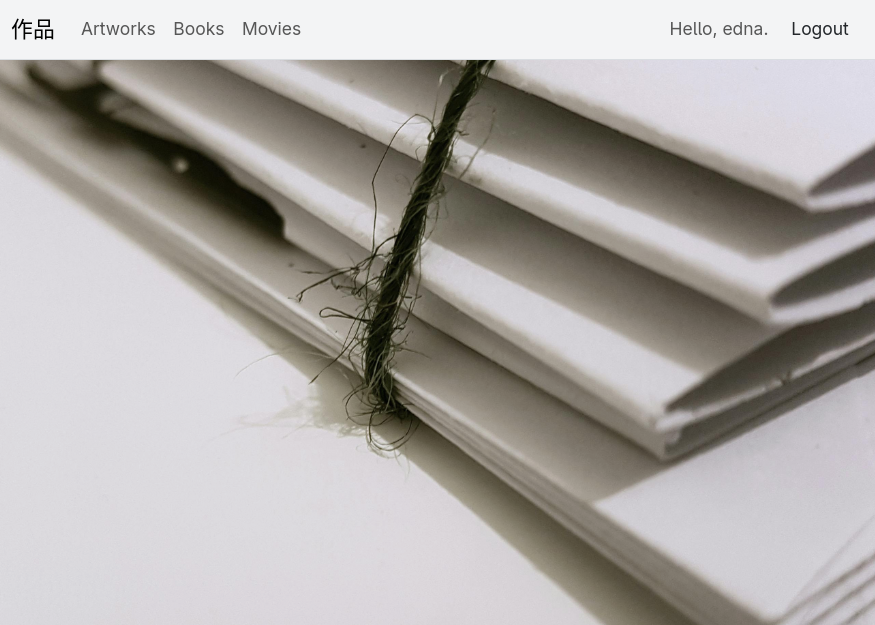

### !Status

Active development.
Core features are being implemented and expanding.



### Sakuhin - Artwork Cataloging App

A lightweight local cataloging app for artists, collectors, and gallery owners.
Designed to manage and organize collections of:

- Artworks
- Books
- Movies

The application runs locally and gives you full control over your data, with simple CSV import/export at any time.

Sakuhin (作品, Japanese) - work (e.g. book, film, painting, composition), piece, production, opus.

### Planned binary builds for

- Linux
- macOS
- Windows

### Designed for

- Artists documenting their work
- Private collectors
- Small galleries
- Researchers and archivists
- Anyone who needs a personal, structured media catalog

### Tech Stack

- Python, Django, Bootstrap5, SQLite, HTML, CSV

### Running Locally (Development Mode)

##### 1. Create and activate virtual environment

```bash
python -m venv .venv
source .venv/bin/activate      # macOS / Linux
.venv\Scripts\activate         # Windows
```

##### 2. Install dependencies

```bash
pip install --upgrade pip
pip install -r requirements.txt
```

##### 3. Apply Migrations

```bash
cd src
python manage.py migrate
```

##### 4. Run development server

```bash
python manage.py runserver
```

<http://127.0.0.1:8000>
